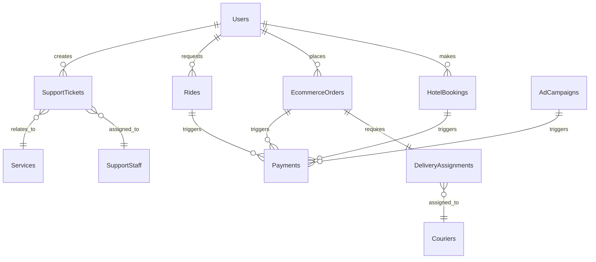

# Consolidated Platform Architecture Split Specifications

This document consolidates all existing spec information to create the perfect
specification documents.

## Current Requirements (from platform-architecture-split-requirements-UPDATED.md)

# Requirements Document - Platform Architecture Split (UPDATED)

## Introduction

This document outlines the requirements for splitting the current monolithic
Supabase platform into a hybrid architecture with Supabase and Railway services.
The platform includes hotel booking, taxi/ride sharing, ecommerce marketplace,
advertising, social media, and support services.

## Glossary

- **System**: The complete multi-service platform
- **Supabase_Services**: Database-intensive services remaining on Supabase
- **Railway_Services**: Compute-intensive services migrated to Railway
- **API_Gateway**: Central routing and load balancing service
- **Service_Mesh**: Inter-service communication infrastructure
- **Cross_Service_Transaction**: Operations spanning multiple services

## Requirements

### Requirement 1: Core Service Migration

**User Story:** As a platform architect, I want to migrate compute-intensive
services to Railway while keeping database-intensive services on Supabase, so
that we can optimize performance and costs.

#### Acceptance Criteria

1. WHEN services are classified by intensity THEN the system SHALL place
   database-intensive services (score > 7) on Supabase
2. WHEN services are classified by intensity THEN the system SHALL place
   compute-intensive services (score > 7) on Railway
3. WHEN services are migrated THEN the system SHALL maintain all existing
   functionality without degradation
4. THE system SHALL support independent scaling of Supabase and Railway services
5. THE system SHALL maintain sub-200ms API response times for 95th percentile
   requests
6. THE system SHALL ensure zero data loss during migration processes
7. THE system SHALL provide rollback capabilities for each migration phase

### Requirement 2: API Gateway and Load Balancing

**User Story:** As a platform user, I want seamless access to all services
through a unified API, so that I don't need to know which platform hosts each
service.

#### Acceptance Criteria

1. WHEN users make API requests THEN the system SHALL route them to appropriate
   services transparently
2. WHEN services are unavailable THEN the system SHALL provide graceful
   degradation and error handling
3. WHEN traffic increases THEN the system SHALL automatically distribute load
   across available service instances
4. THE system SHALL maintain consistent authentication and authorization across
   all services
5. THE system SHALL provide unified API documentation and versioning
6. THE system SHALL implement rate limiting and security policies consistently
7. THE system SHALL monitor and log all cross-service communications

### Requirement 3: Real-time Communication and Events

**User Story:** As a platform user, I want real-time updates across all
services, so that I receive immediate notifications and live data updates.

#### Acceptance Criteria

1. WHEN events occur in any service THEN the system SHALL propagate relevant
   updates to subscribed clients
2. WHEN real-time connections are established THEN the system SHALL maintain
   sub-100ms latency for live updates
3. WHEN services communicate THEN the system SHALL ensure message delivery
   guarantees and ordering
4. THE system SHALL support WebSocket connections across service boundaries
5. THE system SHALL handle connection failures and automatic reconnection
6. THE system SHALL scale real-time connections based on demand
7. THE system SHALL maintain event history and replay capabilities

### Requirement 4: Data Consistency and Transactions

**User Story:** As a platform administrator, I want data consistency across all
services, so that business operations remain accurate and reliable.

#### Acceptance Criteria

1. WHEN cross-service transactions occur THEN the system SHALL maintain ACID
   properties
2. WHEN data is updated in one service THEN the system SHALL propagate changes
   to dependent services
3. WHEN conflicts arise THEN the system SHALL resolve them using defined
   business rules
4. THE system SHALL provide audit trails for all cross-service data
   modifications
5. THE system SHALL support eventual consistency for non-critical operations
6. THE system SHALL maintain referential integrity across service boundaries
7. THE system SHALL provide data backup and recovery across all services

### Requirement 5: Service Authentication and Authorization

**User Story:** As a platform user, I want single sign-on across all services,
so that I can access all platform features with one authentication.

#### Acceptance Criteria

1. WHEN users authenticate THEN the system SHALL provide access tokens valid
   across all services
2. WHEN services communicate THEN the system SHALL validate service-to-service
   authentication
3. WHEN permissions are checked THEN the system SHALL enforce role-based access
   control consistently
4. THE system SHALL support fine-grained permissions for different service
   operations
5. THE system SHALL maintain user sessions across service boundaries
6. THE system SHALL provide secure token refresh and revocation mechanisms
7. THE system SHALL log all authentication and authorization events

### Requirement 6: Service Monitoring and Observability

**User Story:** As a platform administrator, I want comprehensive monitoring
across all services, so that I can maintain system health and performance.

#### Acceptance Criteria

1. WHEN services operate THEN the system SHALL collect performance metrics and
   health indicators
2. WHEN issues occur THEN the system SHALL provide alerting and notification
   mechanisms
3. WHEN debugging is needed THEN the system SHALL provide distributed tracing
   across services
4. THE system SHALL maintain service dependency maps and impact analysis
5. THE system SHALL provide unified logging and log aggregation
6. THE system SHALL support custom dashboards and reporting
7. THE system SHALL maintain historical performance data and trends

### Requirement 7: Deployment and DevOps Integration

**User Story:** As a DevOps engineer, I want automated deployment and management
of all services, so that I can maintain consistent operations across platforms.

#### Acceptance Criteria

1. WHEN deployments occur THEN the system SHALL support blue-green deployment
   strategies
2. WHEN services are updated THEN the system SHALL provide zero-downtime
   deployment capabilities
3. WHEN rollbacks are needed THEN the system SHALL support automatic and manual
   rollback procedures
4. THE system SHALL provide infrastructure as code for all service
   configurations
5. THE system SHALL support automated testing and validation in deployment
   pipelines
6. THE system SHALL maintain environment parity across development, staging, and
   production
7. THE system SHALL provide deployment approval workflows and change management

### Requirement 8: Performance and Scalability

**User Story:** As a platform stakeholder, I want the system to handle growth
efficiently, so that we can scale to millions of users without performance
degradation.

#### Acceptance Criteria

1. WHEN traffic increases THEN the system SHALL automatically scale services
   based on demand
2. WHEN database load increases THEN the system SHALL optimize queries and
   connection pooling
3. WHEN response times degrade THEN the system SHALL implement caching and
   optimization strategies
4. THE system SHALL support horizontal scaling for all Railway services
5. THE system SHALL maintain database performance through indexing and query
   optimization
6. THE system SHALL provide CDN integration for static content delivery
7. THE system SHALL support geographic distribution and edge computing

### Requirement 9: Security and Compliance

**User Story:** As a compliance officer, I want the platform to meet security
and regulatory requirements, so that we maintain user trust and legal
compliance.

#### Acceptance Criteria

1. WHEN data is transmitted THEN the system SHALL encrypt all communications
   using TLS 1.3
2. WHEN data is stored THEN the system SHALL encrypt sensitive data at rest
3. WHEN security events occur THEN the system SHALL log and alert on suspicious
   activities
4. THE system SHALL implement proper data isolation between services and tenants
5. THE system SHALL support GDPR, CCPA, and other privacy regulation compliance
6. THE system SHALL provide data retention and deletion capabilities
7. THE system SHALL maintain security audit trails and compliance reporting

### Requirement 10: Delivery and Logistics Management

**User Story:** As a delivery coordinator, I want to manage courier assignments
and track deliveries, so that ecommerce orders are fulfilled efficiently.

#### Acceptance Criteria

1. WHEN ecommerce orders are placed THEN the system SHALL create delivery tasks
   and assign to available couriers
2. WHEN couriers accept assignments THEN the system SHALL provide route
   optimization and delivery instructions
3. WHEN deliveries are in progress THEN the system SHALL track courier locations
   and update delivery status
4. WHEN deliveries are completed THEN the system SHALL confirm completion and
   update order status
5. THE system SHALL handle delivery exceptions and provide alternative
   fulfillment options
6. THE system SHALL maintain delivery performance metrics and courier ratings
7. THE system SHALL integrate with existing payment system for delivery fee
   processing

### Requirement 11: Enhanced Customer Support System

**User Story:** As a customer support manager, I want comprehensive support
tools across all platform services, so that we can efficiently resolve customer
issues.

#### Acceptance Criteria

1. WHEN support tickets are created THEN the system SHALL automatically route
   them to appropriate staff based on service type and expertise
2. WHEN tickets exceed SLA thresholds THEN the system SHALL escalate to
   supervisors and notify stakeholders
3. WHEN staff respond to tickets THEN the system SHALL track response times and
   update performance metrics
4. THE system SHALL provide unified dashboards showing support metrics across
   hotel, taxi, ecommerce, advertising, and social services
5. THE system SHALL integrate with all existing platform services for
   context-aware support
6. THE system SHALL maintain knowledge base and suggested responses for common
   issues across all services
7. THE system SHALL generate comprehensive support analytics and performance
   reports

### Requirement 12: Advanced Analytics and Business Intelligence

**User Story:** As a platform administrator, I want comprehensive analytics
across all services, so that I can make data-driven business decisions.

#### Acceptance Criteria

1. WHEN viewing analytics dashboards THEN the system SHALL display unified
   metrics across hotel, taxi, ecommerce, advertising, and social services
2. WHEN analyzing performance THEN the system SHALL provide real-time KPIs and
   trend analysis
3. WHEN generating reports THEN the system SHALL support custom date ranges,
   filters, and export formats
4. THE system SHALL provide predictive analytics for demand forecasting and
   capacity planning
5. THE system SHALL track user journey analytics across multiple platform
   services
6. THE system SHALL generate automated insights and recommendations for business
   optimization
7. THE system SHALL maintain data privacy compliance while providing
   comprehensive analytics

## Service Classification

### Supabase Services (Database-Intensive)

- **Hotel Booking System**: 27 functions, complete implementation
- **Ecommerce Marketplace**: 8+ functions, complete implementation
- **Payment Processing**: 11 functions, complete implementation
- **Taxi Core Operations**: 9 functions, complete implementation
- **User Management**: 8 functions, complete implementation
- **Utility Services**: Configuration and notification functions

### Railway Services (Compute-Intensive)

- **Social Media Platform**: 12 functions, in migration
- **Advertising Platform**: 8+ functions, complete implementation
- **Admin and Analytics**: 10+ functions, needs enhancement
- **Customer Support**: 4+ functions, needs enhancement
- **Communication Services**: 6+ functions, complete implementation
- **Media Processing**: 3+ functions, complete implementation
- **Delivery and Logistics**: 0 functions, needs creation

## Cross-Service Integration Requirements

### Authentication and Authorization

- Single sign-on across all platform services
- Role-based permissions with service-specific scopes
- Unified user profile management

### Payment Processing Integration

- Shared payment infrastructure for Hotels, Taxi, Ecommerce, Advertising
- Unified wallet system with cross-service balance management
- Consistent commission and fee structures

### Data Consistency and Audit

- Cross-service transaction logging
- Unified audit trails for compliance
- Data synchronization between services

### Communication and Events

- Inter-service messaging for real-time updates
- Event-driven architecture for service coordination
- Notification routing across all services

---

## Current Design (from platform-architecture-split-design-UPDATED.md)

# Design Document - Platform Architecture Split (UPDATED)

## Overview

This document outlines the design for splitting the current monolithic Supabase
platform into a hybrid architecture. The design leverages Supabase for
database-intensive operations and Railway for compute-intensive services, while
maintaining data consistency and service integration.

## Architecture

### High-Level Architecture

```mermaid
graph TB
    subgraph "Client Layer"
        Web[Web App]
        Mobile[Mobile App]
        API[API Clients]
    end

    subgraph "API Gateway (Railway)"
        Gateway[API Gateway]
        LB[Load Balancer]
        Auth[Auth Middleware]
    end

    subgraph "Railway Services"
        Social[Social Media Service]
        Admin[Admin & Analytics Service]
        Support[Customer Support Service]
        Delivery[Delivery & Logistics Service]
        Media[Media Processing Service]
        Comms[Communication Service]
    end

    subgraph "Supabase Services"
        Hotels[Hotel Booking Service]
        Ecommerce[Ecommerce Marketplace Service]
        Taxi[Taxi/Ride Service]
        Payments[Payment Processing Service]
        Users[User Management Service]
        Utils[Utility Services]
    end

    subgraph "Data Layer"
        DB[(Supabase PostgreSQL)]
        Cache[(Redis Cache)]
        Files[(File Storage)]
    end

    subgraph "External Services"
        CDN[Content Delivery Network]
        Maps[Google Maps API]
        PaymentGW[Payment Gateways]
        Analytics[Analytics Service]
    end

    Web --> Gateway
    Mobile --> Gateway
    API --> Gateway

    Gateway --> Social
    Gateway --> Admin
    Gateway --> Support
    Gateway --> Delivery
    Gateway --> Media
    Gateway --> Comms

    Gateway --> Hotels
    Gateway --> Ecommerce
    Gateway --> Taxi
    Gateway --> Payments
    Gateway --> Users
    Gateway --> Utils

    Social --> DB
    Admin --> DB
    Support --> DB
    Delivery --> DB
    Media --> Files
    Comms --> DB

    Hotels --> DB
    Ecommerce --> DB
    Taxi --> DB
    Payments --> DB
    Users --> DB
    Utils --> DB

    Railway Services --> Cache
    Supabase Services --> Cache

    Gateway --> CDN
    Delivery --> Maps
    Payments --> PaymentGW
    Admin --> Analytics
```

## Components and Interfaces

### API Gateway Service (Railway)

**Purpose**: Central routing, authentication, and load balancing **Technology**:
Node.js/Express with Redis caching **Key Features**:

- Request routing based on service endpoints
- JWT token validation and user context extraction
- Rate limiting and security middleware
- Response caching and compression
- Health checking and circuit breaker patterns

**Interface**:

```typescript
interface APIGatewayService {
  routeRequest(request: APIRequest): Promise<APIResponse>;
  authenticateUser(token: string): Promise<UserContext>;
  enforceRateLimit(clientId: string): Promise<boolean>;
  cacheResponse(key: string, data: any, ttl: number): Promise<void>;
}
```

### Supabase Services (Database-Intensive)

#### Hotel Booking Service (Supabase) - COMPLETE

**Functions**: 27 functions including booking management, room availability,
pricing **Database Tables**: `hotels`, `hotel_bookings`, `rooms`, `room_types`,
`hotel_reviews` **Characteristics**: High database intensity (8.5/10),
transaction-heavy operations

#### Ecommerce Marketplace Service (Supabase) - COMPLETE

**Functions**: 8+ functions including cart management, vendor operations, order
processing **Database Tables**: `ecommerce_products`, `ecommerce_orders`,
`ecommerce_carts`, `ecommerce_vendors` **Key Features**:

- Complete shopping cart functionality with variants and promo codes
- Vendor onboarding and management system
- Order processing and payment integration
- Product search integration with Algolia

**Interface**:

```typescript
interface EcommerceService {
  addToCart(userId: string, items: CartItem[]): Promise<Cart>;
  checkoutCart(cartId: string, paymentInfo: PaymentInfo): Promise<Order>;
  applyVendor(vendorApplication: VendorApplication): Promise<Vendor>;
  getVendorBalance(vendorId: string): Promise<VendorBalance>;
}
```

#### Payment Processing Service (Supabase) - COMPLETE

**Functions**: 11 functions for payment initialization, webhooks, wallet
management **Integration**: Paystack (primary), Stripe (international)
**Features**: Multi-service payment support (hotel, taxi, ecommerce,
advertising)

#### Taxi/Ride Service (Supabase) - COMPLETE

**Functions**: 9 core functions for ride requests, driver management, location
tracking **Database Tables**: `rides`, `driver_profiles`, `ride_history`
**Features**: Real-time location tracking, driver-rider matching, fare
calculation

### Railway Services (Compute-Intensive)

#### Social Media Service (Railway) - IN PROGRESS

**Functions**: 12 functions for posts, comments, likes, messaging **Status**:
Currently being migrated to Railway **Features**: Real-time social feeds,
messaging, content moderation

#### Advertising Service (Railway) - COMPLETE

**Functions**: 8+ functions for campaign management, ad serving, analytics
**Database Tables**: `ad_campaigns`, `advertiser_profiles` **Features**:
Campaign optimization, real-time bidding, performance analytics

#### Customer Support Service (Railway) - NEEDS ENHANCEMENT

**Current Functions**: 4 basic functions (`create-support-ticket`,
`get-my-tickets`, `reply-to-ticket`, `report-content`) **Enhancement Needed**:

- Intelligent ticket routing based on service type
- SLA monitoring and escalation workflows
- Cross-service integration for context-aware support
- Support staff management and performance analytics

**Enhanced Interface**:

```typescript
interface SupportService {
  createTicket(ticket: SupportTicket): Promise<Ticket>;
  routeTicket(ticketId: string): Promise<StaffAssignment>;
  escalateTicket(ticketId: string, reason: string): Promise<Escalation>;
  getUnifiedContext(userId: string): Promise<UserServiceHistory>;
}
```

#### Delivery and Logistics Service (Railway) - NEW

**Status**: Needs to be created **Purpose**: Complete ecommerce order
fulfillment through courier management

**Functions to Create**:

- `assign-delivery`: Automatic courier assignment for orders
- `track-delivery`: Real-time delivery tracking with GPS
- `update-delivery-status`: Status updates and customer notifications
- `get-courier-assignments`: Courier workload management
- `optimize-delivery-routes`: Route optimization using Google Maps
- `handle-delivery-exceptions`: Failed delivery and alternative options

**Database Tables to Create**:

- `delivery_assignments`: Links orders to couriers
- `courier_profiles`: Courier information and availability
- `delivery_routes`: Optimized delivery routes
- `delivery_tracking`: Real-time location and status
- `delivery_exceptions`: Failed deliveries and exceptions

**Interface**:

```typescript
interface DeliveryService {
  assignDelivery(orderId: string): Promise<DeliveryAssignment>;
  trackDelivery(deliveryId: string): Promise<DeliveryStatus>;
  optimizeRoute(deliveries: DeliveryAssignment[]): Promise<OptimizedRoute>;
  handleException(
    deliveryId: string,
    exception: DeliveryException
  ): Promise<Resolution>;
}
```

**Integration Points**:

- **Ecommerce Orders**: Automatic assignment when orders reach "shipped" status
- **Payment System**: Delivery fee calculation and processing
- **Notification System**: Customer delivery updates
- **Google Maps API**: Route optimization and tracking

#### Admin and Analytics Service (Railway) - NEEDS ENHANCEMENT

**Current Functions**: Basic admin functions exist **Enhancement Needed**:

- Unified analytics across all platform services
- Real-time KPI dashboards and monitoring
- Predictive analytics and business intelligence
- Custom reporting and data export capabilities

**Enhanced Interface**:

```typescript
interface AnalyticsService {
  getUnifiedDashboard(): Promise<PlatformMetrics>;
  generateReport(params: ReportParams): Promise<Report>;
  getPredictiveInsights(service: string): Promise<Insights>;
  trackUserJourney(userId: string): Promise<JourneyAnalytics>;
}
```

## Data Models

### Core Data Relationships



### Service Data Access Patterns

**Supabase Services**: Direct database access with RLS enforcement **Railway
Services**: Secure connection pooling to Supabase database **Cross-Service**:
API-based communication with authentication

## Correctness Properties

_A property is a characteristic or behavior that should hold true across all
valid executions of a system—essentially, a formal statement about what the
system should do. Properties serve as the bridge between human-readable
specifications and machine-verifiable correctness guarantees._

### Property 1: Service Classification Completeness

_For any_ platform function, it should be classified into exactly one service
module with appropriate platform placement (Supabase or Railway) **Validates:
Requirements 1.1, 1.2**

### Property 2: API Gateway Routing Consistency

_For any_ API request, the gateway should route it to the correct service based
on endpoint patterns without ambiguity **Validates: Requirements 2.1, 2.5**

### Property 3: Authentication Token Validity

_For any_ authenticated request across services, the JWT token should be valid
and provide consistent user context **Validates: Requirements 5.1, 5.5**

### Property 4: Cross-Service Transaction Atomicity

_For any_ operation spanning multiple services, either all related changes
succeed or all are rolled back **Validates: Requirements 4.1, 4.4**

### Property 5: Real-time Event Delivery

_For any_ real-time event, it should be delivered to all subscribed clients
within the specified latency threshold **Validates: Requirements 3.2, 3.6**

### Property 6: Service Health Monitoring

_For any_ service instance, health metrics should be collected and alerts
triggered when thresholds are exceeded **Validates: Requirements 6.1, 6.2**

### Property 7: Data Consistency Across Services

_For any_ data update affecting multiple services, eventual consistency should
be achieved within defined time bounds **Validates: Requirements 4.2, 4.5**

### Property 8: Performance SLA Compliance

_For any_ API request, response time should meet the defined SLA requirements
(95th percentile < 200ms) **Validates: Requirements 1.5, 8.1**

### Property 9: Security Policy Enforcement

_For any_ service communication, security policies should be consistently
enforced across all service boundaries **Validates: Requirements 9.1, 9.4**

### Property 10: Deployment Rollback Capability

_For any_ service deployment, rollback procedures should restore previous
functionality without data loss **Validates: Requirements 7.3, 1.6**

### Property 11: Delivery Assignment Optimization

_For any_ ecommerce order requiring delivery, courier assignment should optimize
for delivery time, cost, and courier availability **Validates: Requirements
10.1, 10.2**

### Property 12: Support Ticket Routing Accuracy

_For any_ support ticket created, it should be routed to appropriate staff based
on service type and expertise without duplication **Validates: Requirements
11.1, 11.2**

### Property 13: Analytics Data Accuracy

_For any_ analytics report, the data should accurately reflect the source
service data within acceptable variance thresholds **Validates: Requirements
12.1, 12.7**

## Error Handling

### Service Communication Errors

- **Circuit Breaker Pattern**: Prevent cascade failures
- **Retry Logic**: Exponential backoff for transient failures
- **Graceful Degradation**: Fallback responses when services unavailable
- **Error Propagation**: Consistent error formats across services

### Data Consistency Errors

- **Conflict Resolution**: Business rule-based conflict resolution
- **Compensation Transactions**: Rollback mechanisms for failed operations
- **Event Sourcing**: Audit trail for all data modifications
- **Eventual Consistency**: Acceptable delay bounds for non-critical operations

## Testing Strategy

### Dual Testing Approach

- **Unit Tests**: Verify specific examples, edge cases, and error conditions for
  each service
- **Property Tests**: Verify universal properties across all services and
  integrations
- Both approaches are complementary and necessary for comprehensive coverage

### Property-Based Testing Configuration

- **Framework**: Jest with fast-check for TypeScript services
- **Iterations**: Minimum 100 iterations per property test
- **Test Tags**: Each test references its design document property
- **Coverage**: All 13 correctness properties must have corresponding property
  tests

### Integration Testing

- **End-to-End**: Complete user workflows across multiple services
- **Service Mesh**: Inter-service communication and authentication
- **Performance**: Load testing and scalability validation
- **Security**: Penetration testing and vulnerability assessment

### Testing Environments

- **Development**: Local Docker Compose environment
- **Staging**: Production-like environment with full service mesh
- **Production**: Blue-green deployment with canary testing

## Platform Split Summary

### Service Distribution

1. **Supabase Services**: 70+ functions across 6 database-intensive services
   - Hotel Booking (27 functions) ✅
   - Ecommerce Marketplace (8+ functions) ✅
   - Payment Processing (11 functions) ✅
   - Taxi/Ride Services (9 functions) ✅
   - User Management (8 functions) ✅
   - Utility Services (7+ functions) ✅

2. **Railway Services**: 30+ functions across 7 compute-intensive services
   - Social Media Platform (12 functions) 🔄
   - Advertising Platform (8+ functions) ✅
   - Admin & Analytics (10+ functions) 📈
   - Customer Support (4+ functions) 📈
   - Communication Services (6+ functions) ✅
   - Media Processing (3+ functions) ✅
   - Delivery & Logistics (0 functions) 🆕

### Key Dependencies

1. **Database Access**: All services connect to single Supabase PostgreSQL
2. **Authentication**: Unified JWT-based authentication across all services
3. **Payment Integration**: Shared payment processing for all revenue services
4. **Real-time Updates**: Supabase Realtime for live data synchronization
5. **File Storage**: Supabase Storage for media and document management

### Migration Readiness

- **Completed Services**: Hotel, Ecommerce, Payment, Taxi, User Management,
  Advertising, Communication, Media
- **In Progress**: Social Media Platform (Phase 5)
- **Enhancement Needed**: Customer Support, Admin Analytics
- **New Development**: Delivery and Logistics Service

---

## Current Task Information (from CORRECTED_PLATFORM_ARCHITECTURE_UPDATE.md)

### Updated Implementation Phases

#### Phase 6: Delivery and Logistics Service Development (Railway) - NEW

**Duration**: 5 weeks

- [ ] 6.1 Create Railway delivery service container
  - Set up Docker container for delivery operations (6+ functions)
  - Configure route optimization and tracking systems
  - Implement courier management and assignment algorithms
  - Set up real-time location tracking infrastructure
  - _Requirements: 10.1, 10.2, 10.3_

- [ ] 6.2 Develop delivery management functions
  - Create `assign-delivery`, `track-delivery`, `update-delivery-status`
  - Implement `get-courier-assignments`, `optimize-delivery-routes`
  - Add `handle-delivery-exceptions` and alternative fulfillment
  - Set up courier onboarding and verification system
  - _Requirements: 10.1, 10.4, 10.5_

- [ ] 6.3 Implement delivery tracking and optimization
  - Set up real-time GPS tracking for couriers
  - Implement route optimization algorithms (Google Maps integration)
  - Add delivery time estimation and customer notifications
  - Create delivery performance analytics and reporting
  - _Requirements: 10.2, 10.3, 10.6_

- [ ] 6.4 Integrate delivery with ecommerce orders
  - Connect delivery system with existing ecommerce order fulfillment
  - Implement automatic delivery assignment on order completion
  - Add delivery fee calculation and payment integration
  - Set up customer delivery preferences and scheduling
  - _Requirements: 10.1, 10.7_

- [ ]\* 6.5 Write property test for delivery assignment optimization
  - **Property 13: Delivery Assignment Optimization**
  - **Validates: Requirements 10.1, 10.2**

#### Phase 7: Enhanced Customer Support Service (Railway) - ENHANCEMENT

**Duration**: 3 weeks

- [ ] 7.1 Enhance existing support service
  - Expand current support functions with routing algorithms
  - Implement ticket escalation and priority management
  - Add support staff management and assignment system
  - Set up SLA monitoring and automated alerts
  - _Requirements: 11.1, 11.2, 11.4_

- [ ] 7.2 Implement cross-service support integration
  - Connect support system with hotel, taxi, ecommerce services
  - Add service-specific ticket categories and routing
  - Implement context-aware support with service data access
  - Create unified support dashboard across all services
  - _Requirements: 11.5, 11.4_

- [ ] 7.3 Add support analytics and knowledge management
  - Implement support performance metrics and reporting
  - Add knowledge base and suggested response system
  - Create support staff performance tracking
  - Set up automated insights and optimization recommendations
  - _Requirements: 11.7, 11.6_

- [ ]\* 7.4 Write property test for support ticket routing
  - **Property 14: Support Ticket Routing Consistency**
  - **Validates: Requirements 11.1, 11.2**

#### Phase 8: Advanced Analytics Service Enhancement (Railway) - ENHANCEMENT

**Duration**: 4 weeks

- [ ] 8.1 Create unified analytics service
  - Enhance existing admin analytics with cross-service data
  - Implement real-time KPI dashboards and monitoring
  - Add predictive analytics and forecasting capabilities
  - Set up automated insight generation and recommendations
  - _Requirements: 12.1, 12.2, 12.6_

- [ ] 8.2 Implement business intelligence features
  - Add custom report generation and export capabilities
  - Implement user journey analytics across services
  - Create demand forecasting and capacity planning tools
  - Set up A/B testing and performance optimization analytics
  - _Requirements: 12.3, 12.4, 12.5_

- [ ]\* 8.3 Write property test for analytics data consistency
  - **Property 15: Cross-Service Analytics Accuracy**
  - **Validates: Requirements 12.1, 12.7**

## Analysis Summary

Based on the corrected analysis, the platform is more complete than initially
assessed:

### Already Complete ✅

- **Hotel Booking System**: 27 functions (complete)
- **Ecommerce Marketplace**: 8+ functions (complete) - Previously thought
  missing
- **Payment Processing**: 11 functions (complete)
- **Taxi/Ride Services**: 9 functions (complete)
- **Advertising Platform**: 8+ functions (complete)
- **Communication Services**: 6+ functions (complete)
- **Media Processing**: 3+ functions (complete)

### In Progress 🔄

- **Social Media Platform**: 12 functions (Phase 5 in progress)

### Needs Enhancement 📈

- **Customer Support**: 4+ functions (basic implementation, needs enhancement)
- **Admin & Analytics**: 10+ functions (basic implementation, needs enhancement)

### Missing - High Priority 🆕

- **Delivery and Logistics**: 0 functions (needs creation for ecommerce
  fulfillment)

### Corrected Timeline

- **Total**: 32 weeks (reduced from 41 weeks)
- **Phases 1-5**: Core Services - 16 weeks (in progress)
- **Phase 6**: Delivery and Logistics Service - 5 weeks
- **Phase 7**: Enhanced Customer Support Service - 3 weeks
- **Phase 8**: Advanced Analytics Service Enhancement - 4 weeks
- **Phase 9**: Final Integration and Testing - 4 weeks

This consolidated document provides the foundation for creating perfect
specification documents.
