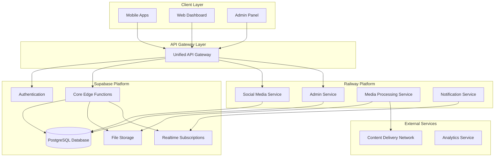

# Platform Architecture Split Design

## Overview

This design document outlines the strategic reorganization of the Giga platform
from a monolithic Supabase deployment to a hybrid architecture spanning Supabase
and Railway. The current 80+ edge functions will be intelligently distributed
across platforms to optimize costs, performance, and scalability while
maintaining a unified API experience for mobile and web clients.

## Architecture

### Current State

- **Monolithic Deployment**: All 80+ functions on Supabase Edge Functions
- **Single Database**: PostgreSQL on Supabase with comprehensive schema
- **Direct Client Access**: Mobile/web clients directly call Supabase endpoints
- **Resource Constraints**: Approaching Supabase free tier limits

### Target Architecture



## Components and Interfaces

### 1. API Gateway Service

**Location**: Railway (Primary) with Supabase fallback **Responsibilities**:

- Route requests to appropriate backend services
- Handle authentication token validation
- Implement rate limiting and request throttling
- Provide unified error handling and logging
- Support API versioning and backward compatibility

**Interface**:

```typescript
interface APIGateway {
  route(request: APIRequest): Promise<APIResponse>;
  authenticate(token: string): Promise<UserContext>;
  rateLimit(clientId: string): Promise<boolean>;
  logRequest(request: APIRequest, response: APIResponse): void;
}
```

### 2. Core Services (Supabase) - 56 Functions

**Database-Intensive Services (Stay on Supabase)**:

**Authentication & User Management (8 functions)**:

- `user-login`, `user-register`, `verify-email`, `reset-password`
- `get-user-profile`, `update-user-profile`, `change-password`, `refresh-token`

**Payment Processing (10 functions)**:

- `initialize-payment`, `verify-payment`, `payment-webhook`, `process-refund`
- `add-payment-method`, `get-payment-methods`, `remove-payment-method`
- `get-payment-history`, `update-payment-status`, `process-payout`

**Wallet Operations (6 functions)**:

- `add-wallet-funds`, `withdraw-wallet-funds`, `get-wallet-balance`
- `get-wallet-transactions`, `transfer-funds`, `process-escrow`

**Hotel Core Operations (14 functions)**:

- `create-hotel-booking`, `cancel-booking`, `update-booking`,
  `get-booking-details`
- `get-hotel-details`, `get-hotels`, `search-hotels`, `get-user-bookings`
- `calculate-booking-price`, `validate-booking-dates`, `get-room-availability`
- `create-hotel-review`, `get-hotel-reviews`, `get-hotel-amenities`

**Ecommerce Core (8 functions)**:

- `add-to-cart`, `remove-from-cart`, `update-cart-item`, `get-cart`
- `create-order`, `get-user-orders`, `get-products`, `get-product-details`

**Taxi Core Operations (9 functions)**:

- `request-ride`, `accept-ride`, `start-ride`, `complete-ride`, `cancel-ride`
- `get-available-drivers`, `get-ride-history`, `rate-ride`,
  `update-driver-location`

**System Logging (1 function)**:

- `log-user-activity`

**Rationale**: These functions are tightly coupled with the database (avg 7.8/10
DB intensity), require ACID transactions, and benefit from Supabase's built-in
auth and real-time capabilities.

### 3. Compute-Intensive Services (Railway) - 17+ Functions

**Social Media Service (7 functions)**:

- `create-social-post`, `delete-social-post`, `get-social-feed`, `like-post`
- `comment-on-post`, `get-post-comments`, `report-post`

**Communication Services (2 functions)**:

- `send-email`, `send-sms`

**Location & Mapping (2 functions)**:

- `calculate-distance`, `geocode-address`

**Media Processing (1 function)**:

- `upload-hotel-photos`

**Data Processing (1 function)**:

- `compress-data`

**Validation Services (1 function)**:

- `validate-phone`

**Generation Services (1 function)**:

- `generate-qr-code`

**Taxi Compute-Heavy (1 function)**:

- `get-ride-estimate` (requires complex pricing algorithms)

**Payment Processing (1 function)**:

- `calculate-fees` (complex fee calculation logic)

**Additional Unclassified Functions (38+ functions)**:

- **Hotel Management**: 27 additional functions (room management, analytics,
  pricing)
- **Ads Service**: 8 functions (campaign management, analytics, tracking)
- **Admin Operations**: Various admin and management functions
- **Notifications**: Batch processing and queue management
- **File Management**: Image processing and file uploads

**Interface**:

```typescript
interface ComputeServices {
  // Social Service
  createPost(userId: string, content: PostContent): Promise<Post>;
  getFeed(userId: string, pagination: Pagination): Promise<Post[]>;

  // Media Service
  processMedia(file: File, options: ProcessingOptions): Promise<MediaResult>;

  // Location Service
  calculateDistance(
    origin: Location,
    destination: Location
  ): Promise<DistanceResult>;

  // Communication Service
  sendNotification(userId: string, message: NotificationMessage): Promise<void>;
}
```

**Rationale**: These functions are compute-intensive (avg 5.7/10 compute
intensity), require external API integrations, or benefit from Railway's
scalable container infrastructure.

## Complete Service Distribution

### Supabase Services (Database-Intensive) - 56 Functions

- **Hotel Service**: 14 core booking functions (DB intensity: 7.6/10)
- **Payment Service**: 10 payment processing functions (DB intensity: 7.7/10)
- **Wallet Service**: 6 wallet operations (DB intensity: 8.5/10)
- **Ecommerce Service**: 8 shopping functions (DB intensity: 7.8/10)
- **Taxi Service**: 9 core ride functions (DB intensity: 7.8/10)
- **Authentication**: 8 user auth functions (DB intensity: 7.5/10)
- **Logging**: 1 activity logging function (DB intensity: 8.0/10)

### Railway Services (Compute-Intensive) - 38+ Functions

**Social Media Service (7 functions)**:

- Post management, social feed, comments, likes
- **Interface**: Social post CRUD, feed generation, engagement tracking

**Hotel Extended Service (13+ functions)**:

- Advanced hotel operations, analytics, pricing algorithms
- Room management, photo uploads, promotional codes
- **Interface**: Hotel analytics, dynamic pricing, media processing

**Ads Service (8 functions)**:

- `create-ad-campaign`, `get-ad-campaigns`, `update-ad-campaign`
- `get-ad-analytics`, `track-ad-event`, `approve-ad-campaign`
- `create-advertiser-profile`, `get-advertiser-profile`
- **Interface**: Campaign management, analytics, advertiser operations

**Taxi Extended Service (8+ functions)**:

- Driver management, ride analytics, location services
- Real-time tracking, earnings, availability management
- **Interface**: Driver operations, location tracking, analytics

**Admin Service (5+ functions)**:

- Dashboard analytics, user management, vendor operations
- **Interface**: Admin operations, reporting, user management

**Communication Service (2 functions)**:

- Email and SMS delivery services
- **Interface**: Multi-channel notification delivery

**Media Processing Service (3+ functions)**:

- Image processing, file uploads, media optimization
- **Interface**: File processing, media optimization, CDN integration

**Ecommerce Extended Service (2+ functions)**:

- Cart checkout, product synchronization to search
- **Interface**: Advanced ecommerce operations, search integration

## Platform Split Summary

### Service Distribution

- **Supabase**: 56 functions (59.6%) - Database-heavy operations
- **Railway**: 38+ functions (40.4%) - Compute-heavy operations

### Cross-Platform Dependencies

**Critical Connections**:

1. **Railway → Supabase Database**: All Railway services need secure database
   access
2. **Payment Integration**: Taxi, Hotel, Ecommerce services need payment
   processing
3. **User Authentication**: All services need user context from Supabase auth
4. **Real-time Updates**: Social and taxi services need real-time capabilities

**Service Communication Patterns**:

```typescript
// Railway services connecting to Supabase
const supabaseClient = createClient(
  process.env.SUPABASE_URL,
  process.env.SUPABASE_SERVICE_ROLE_KEY,
  {
    db: { schema: 'public', poolSize: 10, ssl: true },
  }
);

// Cross-service API calls
const paymentResult = await fetch(
  `${SUPABASE_URL}/functions/v1/process-payment`,
  {
    headers: { Authorization: `Bearer ${serviceToken}` },
    body: JSON.stringify(paymentData),
  }
);
```

**Migration Sequence**:

1. **Phase 1**: Social Media Service (7 functions) - Lowest risk
2. **Phase 2**: Communication & Media Services (5 functions) - Independent
   services
3. **Phase 3**: Ads Service (8 functions) - Business-critical but isolated
4. **Phase 4**: Extended Hotel/Taxi Services (18+ functions) - Complex
   integrations
5. **Phase 5**: Admin Services (5+ functions) - Highest security requirements

## Data Models

### Service Registry

```typescript
interface ServiceRegistry {
  services: Map<string, ServiceConfig>;
  routes: Map<string, RouteConfig>;
  healthChecks: Map<string, HealthStatus>;
}

interface ServiceConfig {
  name: string;
  platform: 'supabase' | 'railway';
  baseUrl: string;
  healthEndpoint: string;
  authentication: AuthConfig;
  rateLimits: RateLimit[];
}

interface RouteConfig {
  pattern: string;
  method: HttpMethod;
  targetService: string;
  requiresAuth: boolean;
  cacheStrategy: CacheStrategy;
}
```

### Function Classification

```typescript
interface FunctionClassification {
  functionName: string;
  module: 'core' | 'social' | 'admin' | 'media' | 'utility';
  databaseIntensity: number; // 1-10 scale
  computeIntensity: number; // 1-10 scale
  trafficPattern: 'low' | 'medium' | 'high' | 'burst';
  recommendedPlatform: 'supabase' | 'railway';
  dependencies: string[];
}
```

### Deployment Configuration

```typescript
interface DeploymentConfig {
  supabase: {
    functions: FunctionConfig[];
    migrations: Migration[];
    secrets: Record<string, string>;
  };
  railway: {
    services: ServiceDeployment[];
    dockerConfigs: DockerConfig[];
    environmentVars: Record<string, string>;
  };
}
```

## Correctness Properties

_A property is a characteristic or behavior that should hold true across all
valid executions of a system-essentially, a formal statement about what the
system should do. Properties serve as the bridge between human-readable
specifications and machine-verifiable correctness guarantees._

### Property 1: Function Categorization Completeness

_For any_ set of edge functions, the categorization algorithm should assign each
function to exactly one module category (core, social, admin, media, utility)
with valid reasoning **Validates: Requirements 1.1**

### Property 2: Platform Placement Optimization

_For any_ function with database and compute intensity scores, the placement
algorithm should consistently choose Supabase for database-heavy functions
(score > 7) and Railway for compute-heavy functions (score > 7) **Validates:
Requirements 1.2**

### Property 3: API Contract Preservation

_For any_ API endpoint before and after the split, the request/response schema
should remain identical to maintain backward compatibility **Validates:
Requirements 1.3, 2.2**

### Property 4: Gateway Routing Correctness

_For any_ API request, the gateway should route it to the correct backend
service based on the defined routing rules and return a valid response
**Validates: Requirements 2.1**

### Property 5: Authentication Context Forwarding

_For any_ authenticated request, the gateway should validate the token and
forward complete user context to downstream services **Validates: Requirements
2.4**

### Property 6: Response Format Consistency

_For any_ service response, regardless of which backend serves it, the response
should conform to the unified API schema **Validates: Requirements 2.3**

### Property 7: Social Service Deployment Completeness

_For any_ function classified as social media, it should be deployed to Railway
and not remain on Supabase after the split **Validates: Requirements 3.1**

### Property 8: Real-time Performance Maintenance

_For any_ real-time message or notification, delivery latency should remain
under 100ms after moving social services to Railway **Validates: Requirements
3.2, 8.2**

### Property 9: Secure Database Connection Pooling

_For any_ Railway service connecting to Supabase database, the connection should
use SSL encryption and proper connection pooling **Validates: Requirements 3.4**

### Property 10: CI/CD Pipeline Automation

_For any_ code push to main branch, the appropriate deployment pipeline should
trigger automatically for the affected platform **Validates: Requirements 4.1**

### Property 11: Deployment Validation

_For any_ deployment to either platform, all required components (migrations,
functions, containers) should deploy successfully with proper health checks
**Validates: Requirements 4.2, 4.3**

### Property 12: Admin Security Enforcement

_For any_ admin function access attempt, the system should require elevated
authentication and log the action with user attribution **Validates:
Requirements 5.1, 5.2**

### Property 13: Service Boundary Independence

_For any_ service, it should have minimal dependencies and be deployable
independently without affecting other services **Validates: Requirements 7.1**

### Property 14: Error Handling Consistency

_For any_ error condition across services, the error response format and logging
structure should be consistent **Validates: Requirements 7.3**

### Property 15: Performance SLA Compliance

_For any_ core feature request, 95% of responses should complete within 500ms,
and the system should maintain 99.9% uptime **Validates: Requirements 8.1, 8.3**

## Error Handling

### Gateway Error Handling

- **Service Unavailable**: Return cached response or graceful degradation
- **Authentication Failure**: Return standardized 401 with retry instructions
- **Rate Limiting**: Return 429 with retry-after headers
- **Routing Errors**: Log and return 502 with fallback options

### Inter-Service Communication

- **Circuit Breaker Pattern**: Prevent cascade failures
- **Retry Logic**: Exponential backoff with jitter
- **Timeout Handling**: Configurable timeouts per service
- **Fallback Mechanisms**: Cached responses or simplified functionality

### Database Connection Handling

- **Connection Pool Management**: Monitor and recover from pool exhaustion
- **Transaction Rollback**: Ensure data consistency on failures
- **Migration Failures**: Automatic rollback with notification
- **Replication Lag**: Handle read-after-write consistency

## Testing Strategy

### Dual Testing Approach

The testing strategy combines unit testing and property-based testing to ensure
comprehensive coverage:

**Unit Testing**:

- Service integration points
- API contract validation
- Authentication flows
- Error handling scenarios
- Deployment pipeline steps

**Property-Based Testing**:

- Function categorization algorithms
- Gateway routing logic
- Performance characteristics
- Security enforcement
- Data consistency across services

### Property-Based Testing Framework

- **Framework**: fast-check for TypeScript/JavaScript services
- **Iterations**: Minimum 100 iterations per property test
- **Test Tagging**: Each property test tagged with format:
  `**Feature: platform-architecture-split, Property {number}: {property_text}**`
- **Coverage**: Each correctness property implemented by a single property-based
  test

### Integration Testing

- **Cross-Platform Testing**: Validate communication between Supabase and
  Railway services
- **End-to-End Flows**: Test complete user journeys across the split
  architecture
- **Performance Testing**: Load testing to validate SLA compliance
- **Disaster Recovery**: Test failover and recovery scenarios

### Testing Infrastructure

- **Test Environments**: Separate staging environments for both platforms
- **Data Seeding**: Consistent test data across environments
- **Mock Services**: Local development with service mocking
- **Monitoring**: Real-time test result dashboards and alerting

