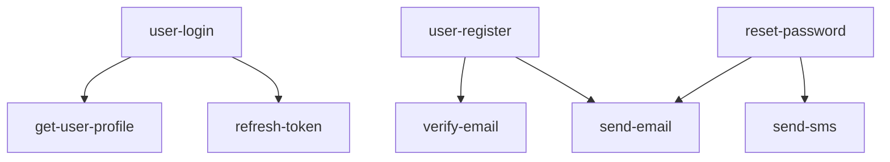
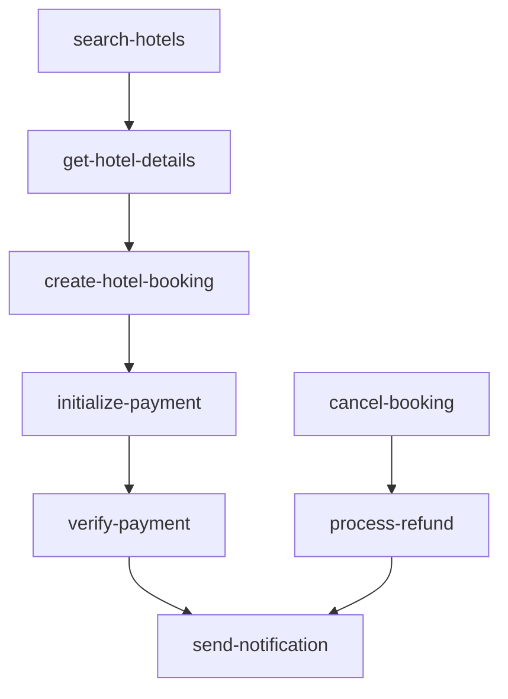
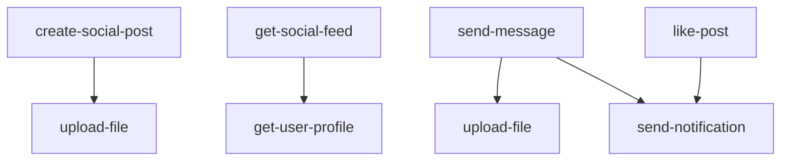
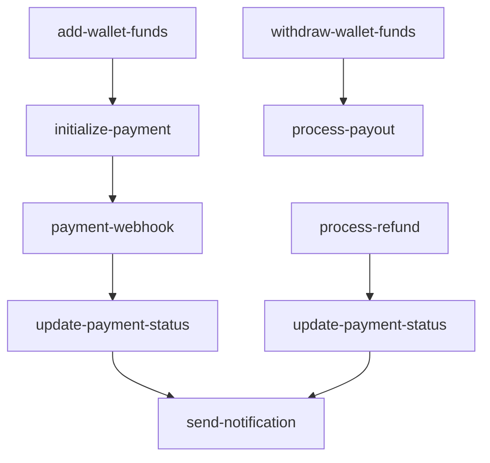

# Function Dependencies and Call Graphs

## Overview

This document maps the dependencies between the 94 active edge functions in the
Giga platform, including database table dependencies, external service
dependencies, and inter-function call patterns. This analysis is critical for
the platform architecture split to ensure proper service boundaries and minimize
cross-platform communication.

## Database Table Dependencies

### Core Tables with High Function Dependencies

#### user_profiles (25+ functions)

**Functions dependent on this table:**

- **Authentication Module**: `user-login`, `user-register`, `get-user-profile`,
  `update-user-profile`, `change-password`, `reset-password`, `verify-email`,
  `refresh-token`
- **Hotel Module**: `create-hotel-booking`, `get-user-bookings`,
  `create-hotel-review`
- **Payment Module**: `initialize-payment`, `get-payment-history`,
  `add-payment-method`
- **E-commerce Module**: `add-to-cart`, `get-cart`, `create-order`,
  `get-user-orders`
- **Taxi Module**: `request-ride`, `get-ride-history`, `rate-ride`
- **Social Module**: `create-social-post`, `get-social-feed`, `send-message`,
  `send-friend-request`
- **Admin Module**: `admin-manage-users`, `admin-dashboard-stats`
- **Utility Module**: `get-user-notifications`, `log-user-activity`

**Cross-Platform Impact**: HIGH - This table is accessed by functions on both
Supabase and Railway, requiring secure cross-platform access patterns.

#### payments (15+ functions)

**Functions dependent on this table:**

- **Payment Module**: `initialize-payment`, `verify-payment`, `payment-webhook`,
  `process-refund`, `get-payment-history`, `update-payment-status`,
  `add-payment-method`, `remove-payment-method`
- **Hotel Module**: `create-hotel-booking`, `cancel-booking`
- **E-commerce Module**: `create-order`
- **Taxi Module**: `complete-ride`
- **Wallet Module**: `add-wallet-funds`, `withdraw-wallet-funds`
- **Admin Module**: `admin-process-payout`, `admin-dashboard-stats`,
  `get-hotel-analytics`

**Cross-Platform Impact**: MEDIUM - Primarily accessed by Supabase functions,
with some admin functions on Railway requiring read access.

#### hotel_bookings (12+ functions)

**Functions dependent on this table:**

- **Hotel Module**: `create-hotel-booking`, `get-user-bookings`,
  `cancel-booking`, `get-booking-details`, `update-booking`,
  `calculate-booking-price`
- **Payment Module**: `initialize-payment`, `verify-payment`
- **Admin Module**: `admin-dashboard-stats`, `get-hotel-analytics`,
  `check-hotel-integrity`
- **Utility Module**: `send-notification`

**Cross-Platform Impact**: MEDIUM - Core hotel functions on Supabase, admin
analytics on Railway.

### Medium Dependency Tables (5-10 functions)

#### social_posts (8 functions)

**Functions dependent on this table:**

- **Social Module**: `create-social-post`, `get-social-feed`, `like-post`,
  `comment-on-post`, `get-post-comments`, `delete-social-post`, `report-post`
- **Admin Module**: `admin-dashboard-stats`

**Cross-Platform Impact**: LOW - Primarily Railway functions with minimal admin
reporting.

#### messages (6 functions)

**Functions dependent on this table:**

- **Social Module**: `send-message`, `get-conversations`,
  `get-conversation-messages`
- **Utility Module**: `send-notification`
- **Admin Module**: `admin-dashboard-stats`

**Cross-Platform Impact**: LOW - Primarily Railway functions.

#### rides (8 functions)

**Functions dependent on this table:**

- **Taxi Module**: `request-ride`, `accept-ride`, `start-ride`, `complete-ride`,
  `cancel-ride`, `get-ride-history`, `rate-ride`
- **Admin Module**: `get-ride-analytics`

**Cross-Platform Impact**: MEDIUM - Core taxi functions on Supabase, admin
analytics on Railway.

## External Service Dependencies

### Payment Providers

#### Paystack (Primary - Nigerian Market)

**Dependent Functions (15):**

- `initialize-payment` - Payment initialization
- `verify-payment` - Payment verification
- `payment-webhook` - Webhook handling
- `process-refund` - Refund processing
- `add-payment-method` - Payment method management
- `remove-payment-method` - Payment method removal
- `create-hotel-booking` - Hotel payment processing
- `cancel-booking` - Booking refund processing
- `complete-ride` - Ride payment processing
- `add-wallet-funds` - Wallet top-up
- `withdraw-wallet-funds` - Wallet withdrawal
- `create-order` - E-commerce payment
- `admin-process-payout` - Vendor payouts
- `process-payout` - General payouts
- `process-escrow` - Escrow transactions

**API Endpoints Used:**

- `/transaction/initialize` - Payment initialization
- `/transaction/verify` - Payment verification
- `/refund` - Refund processing
- `/transfer` - Fund transfers
- `/customer` - Customer management

**Cross-Platform Impact**: HIGH - Functions on both Supabase and Railway need
Paystack access.

#### Stripe (International Market)

**Dependent Functions (8):**

- `initialize-payment` - International payments
- `verify-payment` - Payment verification
- `add-payment-method` - International payment methods
- `create-hotel-booking` - International hotel bookings
- `add-wallet-funds` - International wallet funding
- `create-order` - International e-commerce
- `process-refund` - International refunds
- `process-payout` - International payouts

**API Endpoints Used:**

- `/payment_intents` - Payment processing
- `/customers` - Customer management
- `/payment_methods` - Payment method management
- `/refunds` - Refund processing

### Communication Services

#### SendGrid (Email)

**Dependent Functions (3):**

- `send-email` - General email sending
- `reset-password` - Password reset emails
- `send-notification` - Email notifications

**API Endpoints Used:**

- `/mail/send` - Email sending
- `/templates` - Email templates

#### Twilio (SMS & Phone)

**Dependent Functions (4):**

- `send-sms` - SMS notifications
- `validate-phone` - Phone number validation
- `user-register` - SMS verification during registration
- `send-notification` - SMS notifications

**API Endpoints Used:**

- `/Messages` - SMS sending
- `/Lookups` - Phone validation

#### Firebase (Push Notifications)

**Dependent Functions (2):**

- `send-notification` - Push notifications
- `get-user-notifications` - Notification management

### Location & Mapping Services

#### Google Maps

**Dependent Functions (8):**

- `search-hotels` - Hotel location search
- `request-ride` - Ride location services
- `get-ride-estimate` - Distance/fare calculation
- `get-available-drivers` - Driver location matching
- `geocode-address` - Address to coordinates
- `calculate-distance` - Distance calculation
- `update-driver-location` - Location updates
- `start-ride` - Route planning

**API Endpoints Used:**

- `/geocode` - Address geocoding
- `/distancematrix` - Distance calculation
- `/places` - Place search
- `/directions` - Route planning

### Storage & CDN

#### AWS S3

**Dependent Functions (6):**

- `upload-file` - File storage
- `upload-hotel-photos` - Hotel image storage
- `process-image` - Image processing
- `generate-thumbnails` - Thumbnail generation
- `create-social-post` - Media attachment storage
- `send-message` - Media message storage

**Operations Used:**

- `PutObject` - File uploads
- `GetObject` - File retrieval
- `DeleteObject` - File deletion
- `ListObjects` - File listing

## Inter-Function Call Patterns

### Authentication Flow Dependencies

**Cross-Platform Calls**: None - All authentication functions remain on
Supabase.

### Hotel Booking Flow Dependencies

**Cross-Platform Calls**:

- `send-notification` (Railway) called from booking functions (Supabase)
- Requires async notification queue or API gateway routing

### Social Media Flow Dependencies

**Cross-Platform Calls**:

- `get-user-profile` (Supabase) called from social functions (Railway)
- `upload-file` (Railway) called from social functions (Railway)
- Requires secure cross-platform user data access

### Payment Processing Flow Dependencies

**Cross-Platform Calls**:

- `send-notification` (Railway) called from payment functions (Supabase)
- Admin payout functions (Railway) calling core payment functions (Supabase)

## Critical Cross-Platform Dependencies

### High-Risk Dependencies (Require Immediate Attention)

#### 1. User Profile Access from Railway Services

**Problem**: Social, admin, and utility functions on Railway need frequent
access to user profile data on Supabase.

**Functions Affected**: 12 Railway functions

- All social media functions
- Admin user management functions
- Notification functions

**Solution Options**:

- API Gateway with user context forwarding
- Cached user data on Railway services
- Direct secure database connections

#### 2. Notification Service Calls from Supabase

**Problem**: Core Supabase functions need to trigger notifications handled by
Railway services.

**Functions Affected**: 8 Supabase functions

- Hotel booking confirmations
- Payment confirmations
- Ride status updates
- Order confirmations

**Solution Options**:

- Event queue (Redis/RabbitMQ)
- API Gateway routing
- Webhook-based notifications

#### 3. Admin Analytics Cross-Platform Data Access

**Problem**: Admin functions on Railway need read access to data across all
Supabase tables.

**Functions Affected**: 3 admin functions

- `admin-dashboard-stats`
- `get-hotel-analytics`
- `get-ride-analytics`

**Solution Options**:

- Read-only database connections
- Data replication for analytics
- API-based data aggregation

### Medium-Risk Dependencies

#### 4. File Upload Integration

**Problem**: Social and messaging functions need media upload capabilities.

**Functions Affected**: 4 functions

- `create-social-post`
- `send-message`
- `upload-hotel-photos`
- `process-image`

**Solution**: Centralized media service on Railway with API access.

#### 5. External Service Access

**Problem**: Both platforms need access to external services (Paystack,
SendGrid, etc.).

**Solution**: Shared environment variables and API keys across platforms.

## Recommended Mitigation Strategies

### 1. API Gateway Implementation

**Purpose**: Route cross-platform calls through unified gateway **Benefits**:

- Centralized authentication
- Request/response standardization
- Circuit breaker patterns
- Rate limiting

### 2. Event-Driven Architecture

**Purpose**: Decouple services using event queues **Benefits**:

- Async processing
- Fault tolerance
- Scalability
- Reduced direct dependencies

### 3. Data Access Patterns

**Purpose**: Optimize cross-platform data access **Strategies**:

- Read replicas for Railway analytics
- Cached user contexts
- Batch data synchronization

### 4. Service Contracts

**Purpose**: Define clear interfaces between platforms **Components**:

- OpenAPI specifications
- Data schemas
- Error handling standards
- SLA agreements

## Migration Sequence Recommendations

### Phase 1: Low-Risk Functions

- Utility functions with minimal dependencies
- Media processing functions
- Independent admin functions

### Phase 2: Social Functions

- Implement user context caching
- Set up notification queues
- Migrate social media functions

### Phase 3: Admin Functions

- Set up analytics data access
- Implement enhanced security
- Migrate admin functions

### Phase 4: Integration Testing

- End-to-end user journey testing
- Cross-platform communication validation
- Performance testing under load

This dependency analysis provides the foundation for implementing proper service
boundaries and communication patterns during the platform architecture split.
