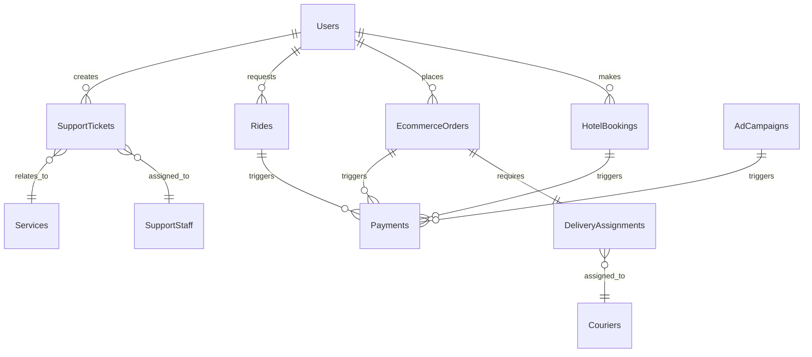

# Design Document - Platform Architecture Split (UPDATED)

## Overview

This document outlines the design for splitting the current monolithic Supabase
platform into a hybrid architecture. The design leverages Supabase for
database-intensive operations and Railway for compute-intensive services, while
maintaining data consistency and service integration.

## Architecture

### High-Level Architecture

```mermaid
graph TB
    subgraph "Client Layer"
        Web[Web App]
        Mobile[Mobile App]
        API[API Clients]
    end

    subgraph "API Gateway (Railway)"
        Gateway[API Gateway]
        LB[Load Balancer]
        Auth[Auth Middleware]
    end

    subgraph "Railway Services"
        Social[Social Media Service]
        Admin[Admin & Analytics Service]
        Support[Customer Support Service]
        Delivery[Delivery & Logistics Service]
        Media[Media Processing Service]
        Comms[Communication Service]
    end

    subgraph "Supabase Services"
        Hotels[Hotel Booking Service]
        Ecommerce[Ecommerce Marketplace Service]
        Taxi[Taxi/Ride Service]
        Payments[Payment Processing Service]
        Users[User Management Service]
        Utils[Utility Services]
    end

    subgraph "Data Layer"
        DB[(Supabase PostgreSQL)]
        Cache[(Redis Cache)]
        Files[(File Storage)]
    end

    subgraph "External Services"
        CDN[Content Delivery Network]
        Maps[Google Maps API]
        PaymentGW[Payment Gateways]
        Analytics[Analytics Service]
    end

    Web --> Gateway
    Mobile --> Gateway
    API --> Gateway

    Gateway --> Social
    Gateway --> Admin
    Gateway --> Support
    Gateway --> Delivery
    Gateway --> Media
    Gateway --> Comms

    Gateway --> Hotels
    Gateway --> Ecommerce
    Gateway --> Taxi
    Gateway --> Payments
    Gateway --> Users
    Gateway --> Utils

    Social --> DB
    Admin --> DB
    Support --> DB
    Delivery --> DB
    Media --> Files
    Comms --> DB

    Hotels --> DB
    Ecommerce --> DB
    Taxi --> DB
    Payments --> DB
    Users --> DB
    Utils --> DB

    Railway Services --> Cache
    Supabase Services --> Cache

    Gateway --> CDN
    Delivery --> Maps
    Payments --> PaymentGW
    Admin --> Analytics
```

## Components and Interfaces

### API Gateway Service (Railway)

**Purpose**: Central routing, authentication, and load balancing **Technology**:
Node.js/Express with Redis caching **Key Features**:

- Request routing based on service endpoints
- JWT token validation and user context extraction
- Rate limiting and security middleware
- Response caching and compression
- Health checking and circuit breaker patterns

**Interface**:

```typescript
interface APIGatewayService {
  routeRequest(request: APIRequest): Promise<APIResponse>;
  authenticateUser(token: string): Promise<UserContext>;
  enforceRateLimit(clientId: string): Promise<boolean>;
  cacheResponse(key: string, data: any, ttl: number): Promise<void>;
}
```

### Supabase Services (Database-Intensive)

#### Hotel Booking Service (Supabase) - COMPLETE

**Functions**: 27 functions including booking management, room availability,
pricing **Database Tables**: `hotels`, `hotel_bookings`, `rooms`, `room_types`,
`hotel_reviews` **Characteristics**: High database intensity (8.5/10),
transaction-heavy operations

#### Ecommerce Marketplace Service (Supabase) - COMPLETE

**Functions**: 8+ functions including cart management, vendor operations, order
processing **Database Tables**: `ecommerce_products`, `ecommerce_orders`,
`ecommerce_carts`, `ecommerce_vendors` **Key Features**:

- Complete shopping cart functionality with variants and promo codes
- Vendor onboarding and management system
- Order processing and payment integration
- Product search integration with Algolia

**Interface**:

```typescript
interface EcommerceService {
  addToCart(userId: string, items: CartItem[]): Promise<Cart>;
  checkoutCart(cartId: string, paymentInfo: PaymentInfo): Promise<Order>;
  applyVendor(vendorApplication: VendorApplication): Promise<Vendor>;
  getVendorBalance(vendorId: string): Promise<VendorBalance>;
}
```

#### Payment Processing Service (Supabase) - COMPLETE

**Functions**: 11 functions for payment initialization, webhooks, wallet
management **Integration**: Paystack (primary), Stripe (international)
**Features**: Multi-service payment support (hotel, taxi, ecommerce,
advertising)

#### Taxi/Ride Service (Supabase) - COMPLETE

**Functions**: 9 core functions for ride requests, driver management, location
tracking **Database Tables**: `rides`, `driver_profiles`, `ride_history`
**Features**: Real-time location tracking, driver-rider matching, fare
calculation

### Railway Services (Compute-Intensive)

#### Social Media Service (Railway) - IN PROGRESS

**Functions**: 12 functions for posts, comments, likes, messaging **Status**:
Currently being migrated to Railway **Features**: Real-time social feeds,
messaging, content moderation

#### Advertising Service (Railway) - COMPLETE

**Functions**: 8+ functions for campaign management, ad serving, analytics
**Database Tables**: `ad_campaigns`, `advertiser_profiles` **Features**:
Campaign optimization, real-time bidding, performance analytics

#### Customer Support Service (Railway) - NEEDS ENHANCEMENT

**Current Functions**: 4 basic functions (`create-support-ticket`,
`get-my-tickets`, `reply-to-ticket`, `report-content`) **Enhancement Needed**:

- Intelligent ticket routing based on service type
- SLA monitoring and escalation workflows
- Cross-service integration for context-aware support
- Support staff management and performance analytics

**Enhanced Interface**:

```typescript
interface SupportService {
  createTicket(ticket: SupportTicket): Promise<Ticket>;
  routeTicket(ticketId: string): Promise<StaffAssignment>;
  escalateTicket(ticketId: string, reason: string): Promise<Escalation>;
  getUnifiedContext(userId: string): Promise<UserServiceHistory>;
}
```

#### Delivery and Logistics Service (Railway) - NEW

**Status**: Needs to be created **Purpose**: Complete ecommerce order
fulfillment through courier management

**Functions to Create**:

- `assign-delivery`: Automatic courier assignment for orders
- `track-delivery`: Real-time delivery tracking with GPS
- `update-delivery-status`: Status updates and customer notifications
- `get-courier-assignments`: Courier workload management
- `optimize-delivery-routes`: Route optimization using Google Maps
- `handle-delivery-exceptions`: Failed delivery and alternative options

**Database Tables to Create**:

- `delivery_assignments`: Links orders to couriers
- `courier_profiles`: Courier information and availability
- `delivery_routes`: Optimized delivery routes
- `delivery_tracking`: Real-time location and status
- `delivery_exceptions`: Failed deliveries and exceptions

**Interface**:

```typescript
interface DeliveryService {
  assignDelivery(orderId: string): Promise<DeliveryAssignment>;
  trackDelivery(deliveryId: string): Promise<DeliveryStatus>;
  optimizeRoute(deliveries: DeliveryAssignment[]): Promise<OptimizedRoute>;
  handleException(
    deliveryId: string,
    exception: DeliveryException
  ): Promise<Resolution>;
}
```

**Integration Points**:

- **Ecommerce Orders**: Automatic assignment when orders reach "shipped" status
- **Payment System**: Delivery fee calculation and processing
- **Notification System**: Customer delivery updates
- **Google Maps API**: Route optimization and tracking

#### Admin and Analytics Service (Railway) - NEEDS ENHANCEMENT

**Current Functions**: Basic admin functions exist **Enhancement Needed**:

- Unified analytics across all platform services
- Real-time KPI dashboards and monitoring
- Predictive analytics and business intelligence
- Custom reporting and data export capabilities

**Enhanced Interface**:

```typescript
interface AnalyticsService {
  getUnifiedDashboard(): Promise<PlatformMetrics>;
  generateReport(params: ReportParams): Promise<Report>;
  getPredictiveInsights(service: string): Promise<Insights>;
  trackUserJourney(userId: string): Promise<JourneyAnalytics>;
}
```

## Data Models

### Core Data Relationships



### Service Data Access Patterns

**Supabase Services**: Direct database access with RLS enforcement **Railway
Services**: Secure connection pooling to Supabase database **Cross-Service**:
API-based communication with authentication

## Correctness Properties

_A property is a characteristic or behavior that should hold true across all
valid executions of a system—essentially, a formal statement about what the
system should do. Properties serve as the bridge between human-readable
specifications and machine-verifiable correctness guarantees._

### Property 1: Service Classification Completeness

_For any_ platform function, it should be classified into exactly one service
module with appropriate platform placement (Supabase or Railway) **Validates:
Requirements 1.1, 1.2**

### Property 2: API Gateway Routing Consistency

_For any_ API request, the gateway should route it to the correct service based
on endpoint patterns without ambiguity **Validates: Requirements 2.1, 2.5**

### Property 3: Authentication Token Validity

_For any_ authenticated request across services, the JWT token should be valid
and provide consistent user context **Validates: Requirements 5.1, 5.5**

### Property 4: Cross-Service Transaction Atomicity

_For any_ operation spanning multiple services, either all related changes
succeed or all are rolled back **Validates: Requirements 4.1, 4.4**

### Property 5: Real-time Event Delivery

_For any_ real-time event, it should be delivered to all subscribed clients
within the specified latency threshold **Validates: Requirements 3.2, 3.6**

### Property 6: Service Health Monitoring

_For any_ service instance, health metrics should be collected and alerts
triggered when thresholds are exceeded **Validates: Requirements 6.1, 6.2**

### Property 7: Data Consistency Across Services

_For any_ data update affecting multiple services, eventual consistency should
be achieved within defined time bounds **Validates: Requirements 4.2, 4.5**

### Property 8: Performance SLA Compliance

_For any_ API request, response time should meet the defined SLA requirements
(95th percentile < 200ms) **Validates: Requirements 1.5, 8.1**

### Property 9: Security Policy Enforcement

_For any_ service communication, security policies should be consistently
enforced across all service boundaries **Validates: Requirements 9.1, 9.4**

### Property 10: Deployment Rollback Capability

_For any_ service deployment, rollback procedures should restore previous
functionality without data loss **Validates: Requirements 7.3, 1.6**

### Property 11: Delivery Assignment Optimization

_For any_ ecommerce order requiring delivery, courier assignment should optimize
for delivery time, cost, and courier availability **Validates: Requirements
10.1, 10.2**

### Property 12: Support Ticket Routing Accuracy

_For any_ support ticket created, it should be routed to appropriate staff based
on service type and expertise without duplication **Validates: Requirements
11.1, 11.2**

### Property 13: Analytics Data Accuracy

_For any_ analytics report, the data should accurately reflect the source
service data within acceptable variance thresholds **Validates: Requirements
12.1, 12.7**

## Error Handling

### Service Communication Errors

- **Circuit Breaker Pattern**: Prevent cascade failures
- **Retry Logic**: Exponential backoff for transient failures
- **Graceful Degradation**: Fallback responses when services unavailable
- **Error Propagation**: Consistent error formats across services

### Data Consistency Errors

- **Conflict Resolution**: Business rule-based conflict resolution
- **Compensation Transactions**: Rollback mechanisms for failed operations
- **Event Sourcing**: Audit trail for all data modifications
- **Eventual Consistency**: Acceptable delay bounds for non-critical operations

## Testing Strategy

### Dual Testing Approach

- **Unit Tests**: Verify specific examples, edge cases, and error conditions for
  each service
- **Property Tests**: Verify universal properties across all services and
  integrations
- Both approaches are complementary and necessary for comprehensive coverage

### Property-Based Testing Configuration

- **Framework**: Jest with fast-check for TypeScript services
- **Iterations**: Minimum 100 iterations per property test
- **Test Tags**: Each test references its design document property
- **Coverage**: All 13 correctness properties must have corresponding property
  tests

### Integration Testing

- **End-to-End**: Complete user workflows across multiple services
- **Service Mesh**: Inter-service communication and authentication
- **Performance**: Load testing and scalability validation
- **Security**: Penetration testing and vulnerability assessment

### Testing Environments

- **Development**: Local Docker Compose environment
- **Staging**: Production-like environment with full service mesh
- **Production**: Blue-green deployment with canary testing

## Platform Split Summary

### Service Distribution

1. **Supabase Services**: 70+ functions across 6 database-intensive services
   - Hotel Booking (27 functions) ✅
   - Ecommerce Marketplace (8+ functions) ✅
   - Payment Processing (11 functions) ✅
   - Taxi/Ride Services (9 functions) ✅
   - User Management (8 functions) ✅
   - Utility Services (7+ functions) ✅

2. **Railway Services**: 30+ functions across 7 compute-intensive services
   - Social Media Platform (12 functions) 🔄
   - Advertising Platform (8+ functions) ✅
   - Admin & Analytics (10+ functions) 📈
   - Customer Support (4+ functions) 📈
   - Communication Services (6+ functions) ✅
   - Media Processing (3+ functions) ✅
   - Delivery & Logistics (0 functions) 🆕

### Key Dependencies

1. **Database Access**: All services connect to single Supabase PostgreSQL
2. **Authentication**: Unified JWT-based authentication across all services
3. **Payment Integration**: Shared payment processing for all revenue services
4. **Real-time Updates**: Supabase Realtime for live data synchronization
5. **File Storage**: Supabase Storage for media and document management

### Migration Readiness

- **Completed Services**: Hotel, Ecommerce, Payment, Taxi, User Management,
  Advertising, Communication, Media
- **In Progress**: Social Media Platform (Phase 5)
- **Enhancement Needed**: Customer Support, Admin Analytics
- **New Development**: Delivery and Logistics Service

This design provides a comprehensive architecture for the platform split,
acknowledging the complete ecommerce implementation while focusing on the
actually missing delivery service and needed enhancements to support and
analytics capabilities.
