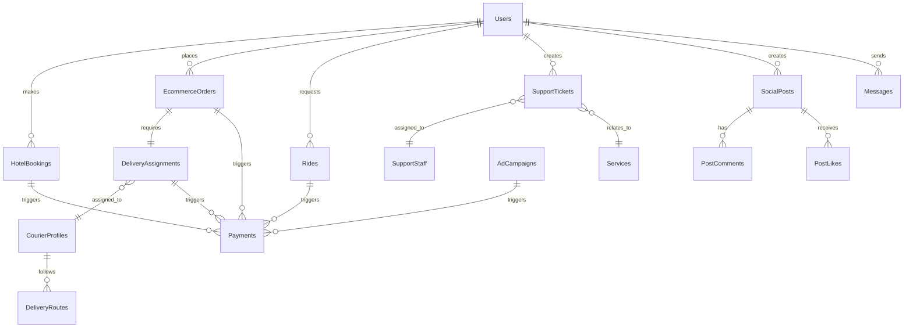

# Design Document - Complete Platform Enhancement

## Overview

This document outlines the design for completing the platform architecture split
and enhancing the existing multi-service platform. The design leverages the
already-completed foundation (Phases 1-5) and focuses on the remaining critical
components: completing social media migration, creating the missing delivery
service, and enhancing support and analytics capabilities.

## Architecture

### High-Level Architecture

```mermaid
graph TB
    subgraph "Client Layer"
        Web[Web App]
        Mobile[Mobile App]
        API[API Clients]
    end

    subgraph "API Gateway (Railway) - COMPLETE ✅"
        Gateway[API Gateway]
        LB[Load Balancer]
        Auth[Auth Middleware]
    end

    subgraph "Railway Services"
        Social[Social Media Service - IN PROGRESS 🔄]
        Admin[Admin & Analytics Service - ENHANCE 📈]
        Support[Customer Support Service - ENHANCE 📈]
        Delivery[Delivery & Logistics Service - NEW 🆕]
        Media[Media Processing Service - COMPLETE ✅]
        Comms[Communication Service - COMPLETE ✅]
        Ads[Advertising Service - COMPLETE ✅]
    end

    subgraph "Supabase Services - ALL COMPLETE ✅"
        Hotels[Hotel Booking Service - 27 functions]
        Ecommerce[Ecommerce Marketplace Service - 8+ functions]
        Taxi[Taxi/Ride Service - 9 functions]
        Payments[Payment Processing Service - 11 functions]
        Users[User Management Service - 8 functions]
        Utils[Utility Services - 7+ functions]
    end

    subgraph "Data Layer"
        DB[(Supabase PostgreSQL)]
        Cache[(Redis Cache)]
        Files[(File Storage)]
    end

    subgraph "External Services"
        CDN[Content Delivery Network]
        Maps[Google Maps API]
        PaymentGW[Payment Gateways]
        Analytics[Analytics Service]
    end

    Web --> Gateway
    Mobile --> Gateway
    API --> Gateway

    Gateway --> Social
    Gateway --> Admin
    Gateway --> Support
    Gateway --> Delivery
    Gateway --> Media
    Gateway --> Comms
    Gateway --> Ads

    Gateway --> Hotels
    Gateway --> Ecommerce
    Gateway --> Taxi
    Gateway --> Payments
    Gateway --> Users
    Gateway --> Utils

    Social --> DB
    Admin --> DB
    Support --> DB
    Delivery --> DB
    Media --> Files
    Comms --> DB
    Ads --> DB

    Hotels --> DB
    Ecommerce --> DB
    Taxi --> DB
    Payments --> DB
    Users --> DB
    Utils --> DB

    Railway Services --> Cache
    Supabase Services --> Cache

    Gateway --> CDN
    Delivery --> Maps
    Payments --> PaymentGW
    Admin --> Analytics
```

## Components and Interfaces

### Completed Foundation (Phases 1-5) ✅

#### API Gateway Service (Railway) - COMPLETE

- **Status**: Fully implemented and deployed
- **Features**: Request routing, JWT authentication, rate limiting, caching,
  health checks
- **Performance**: Sub-200ms response times, circuit breaker patterns

#### Supabase Services - ALL COMPLETE

All database-intensive services are fully implemented:

- **Hotel Booking**: 27 functions, complete booking lifecycle
- **Ecommerce Marketplace**: 8+ functions, cart, checkout, vendor management
- **Payment Processing**: 11 functions, Paystack/Stripe integration
- **Taxi/Ride Services**: 9 functions, ride matching, location tracking
- **User Management**: 8 functions, profiles, authentication, roles
- **Utility Services**: 7+ functions, configuration, notifications

#### Railway Services - PARTIALLY COMPLETE

- **Advertising Platform**: 8+ functions, complete ✅
- **Communication Services**: 6+ functions, complete ✅
- **Media Processing**: 3+ functions, complete ✅

### Services Requiring Completion/Enhancement

#### Social Media Service (Railway) - IN PROGRESS 🔄

**Current Status**: Container created, migration in progress **Functions**: 12
functions for posts, comments, likes, messaging **Completion Needed**: Finalize
migration from Supabase to Railway

**Interface**:

```typescript
interface SocialMediaService {
  createPost(userId: string, content: PostContent): Promise<Post>;
  getPersonalizedFeed(userId: string, pagination: Pagination): Promise<Feed>;
  createComment(
    postId: string,
    userId: string,
    content: string
  ): Promise<Comment>;
  likePost(postId: string, userId: string): Promise<LikeResult>;
  sendMessage(
    senderId: string,
    recipientId: string,
    message: Message
  ): Promise<MessageResult>;
}
```

#### Delivery and Logistics Service (Railway) - NEW 🆕

**Status**: Needs complete creation **Purpose**: Critical missing component for
ecommerce order fulfillment

**Functions to Create (6+ functions)**:

- `assign-delivery`: Automatic courier assignment for orders
- `track-delivery`: Real-time delivery tracking with GPS
- `update-delivery-status`: Status updates and customer notifications
- `get-courier-assignments`: Courier workload management
- `optimize-delivery-routes`: Route optimization using Google Maps
- `handle-delivery-exceptions`: Failed delivery and alternative options

**Database Tables to Create**:

```sql
-- Courier management
CREATE TABLE courier_profiles (
  id UUID PRIMARY KEY DEFAULT gen_random_uuid(),
  user_id UUID REFERENCES auth.users(id),
  vehicle_type TEXT NOT NULL,
  license_number TEXT,
  is_available BOOLEAN DEFAULT false,
  current_location POINT,
  rating DECIMAL(3,2) DEFAULT 5.0,
  total_deliveries INTEGER DEFAULT 0,
  created_at TIMESTAMPTZ DEFAULT NOW()
);

-- Delivery assignments
CREATE TABLE delivery_assignments (
  id UUID PRIMARY KEY DEFAULT gen_random_uuid(),
  order_id UUID REFERENCES ecommerce_orders(id),
  courier_id UUID REFERENCES courier_profiles(id),
  pickup_address TEXT NOT NULL,
  delivery_address TEXT NOT NULL,
  estimated_delivery_time TIMESTAMPTZ,
  actual_delivery_time TIMESTAMPTZ,
  delivery_fee DECIMAL(10,2),
  status TEXT DEFAULT 'assigned',
  created_at TIMESTAMPTZ DEFAULT NOW()
);

-- Route optimization
CREATE TABLE delivery_routes (
  id UUID PRIMARY KEY DEFAULT gen_random_uuid(),
  courier_id UUID REFERENCES courier_profiles(id),
  route_data JSONB, -- Optimized route from Google Maps
  total_distance_km DECIMAL(8,2),
  estimated_duration_minutes INTEGER,
  delivery_assignments UUID[] -- Array of delivery IDs
);

-- Real-time tracking
CREATE TABLE delivery_tracking (
  id UUID PRIMARY KEY DEFAULT gen_random_uuid(),
  delivery_id UUID REFERENCES delivery_assignments(id),
  current_location POINT,
  status_update TEXT,
  timestamp TIMESTAMPTZ DEFAULT NOW()
);
```

**Interface**:

```typescript
interface DeliveryService {
  assignDelivery(orderId: string): Promise<DeliveryAssignment>;
  trackDelivery(deliveryId: string): Promise<DeliveryStatus>;
  optimizeRoute(deliveries: DeliveryAssignment[]): Promise<OptimizedRoute>;
  updateDeliveryStatus(
    deliveryId: string,
    status: DeliveryStatus,
    location?: Location
  ): Promise<void>;
  getCourierAssignments(courierId: string): Promise<Assignment[]>;
  handleException(
    deliveryId: string,
    exception: DeliveryException
  ): Promise<Resolution>;
}
```

**Integration Points**:

- **Ecommerce Orders**: Automatic assignment when orders reach "shipped" status
- **Payment System**: Delivery fee calculation and processing
- **Notification System**: Customer delivery updates via existing communication
  service
- **Google Maps API**: Route optimization and real-time tracking

#### Enhanced Customer Support Service (Railway) - ENHANCEMENT 📈

**Current Status**: Basic implementation exists (4 functions) **Enhancement
Needed**: Intelligent routing, SLA monitoring, cross-service integration

**Current Functions**:

- `create-support-ticket`
- `get-my-tickets`
- `reply-to-ticket`
- `report-content`

**Enhanced Functions to Add**:

- `route-ticket-intelligently`: AI-based routing by service type and expertise
- `escalate-ticket`: Automatic SLA-based escalation
- `get-unified-context`: Cross-service user history for context-aware support
- `manage-support-staff`: Staff assignment and performance tracking
- `generate-support-analytics`: Performance metrics and insights

**Enhanced Interface**:

```typescript
interface EnhancedSupportService {
  createTicket(ticket: SupportTicket): Promise<Ticket>;
  routeTicketIntelligently(ticketId: string): Promise<StaffAssignment>;
  escalateTicket(ticketId: string, reason: string): Promise<Escalation>;
  getUnifiedContext(userId: string): Promise<UserServiceHistory>;
  generateSupportAnalytics(dateRange: DateRange): Promise<SupportMetrics>;
  manageSupportStaff(
    staffId: string,
    action: StaffAction
  ): Promise<StaffResult>;
}
```

#### Advanced Analytics Service (Railway) - ENHANCEMENT 📈

**Current Status**: Basic admin functions exist **Enhancement Needed**: Unified
cross-service analytics, predictive insights, business intelligence

**Enhanced Functions to Add**:

- `get-unified-dashboard`: Cross-service KPI dashboard
- `generate-predictive-insights`: AI-powered business forecasting
- `track-user-journey`: Cross-service user behavior analytics
- `create-custom-report`: Flexible reporting with export capabilities
- `monitor-real-time-kpis`: Live performance monitoring

**Enhanced Interface**:

```typescript
interface AdvancedAnalyticsService {
  getUnifiedDashboard(services: string[]): Promise<PlatformMetrics>;
  generatePredictiveInsights(
    service: string,
    timeframe: string
  ): Promise<Insights>;
  trackUserJourney(userId: string): Promise<JourneyAnalytics>;
  createCustomReport(params: ReportParams): Promise<Report>;
  monitorRealTimeKPIs(): Promise<LiveMetrics>;
}
```

## Data Models

### Core Data Relationships



### Service Data Access Patterns

**Supabase Services**: Direct database access with RLS enforcement (COMPLETE)
**Railway Services**: Secure connection pooling to Supabase database
**Cross-Service**: API-based communication with JWT authentication through API
Gateway

## Correctness Properties

_A property is a characteristic or behavior that should hold true across all
valid executions of a system—essentially, a formal statement about what the
system should do. Properties serve as the bridge between human-readable
specifications and machine-verifiable correctness guarantees._

Based on the prework analysis, here are the key correctness properties:

### Property 1: Service Classification and Placement Consistency

_For any_ platform function, it should be classified into exactly one service
module with appropriate platform placement (Supabase for database-intensive,
Railway for compute-intensive) **Validates: Requirements 1.1, 1.2**

### Property 2: API Gateway Routing Accuracy

_For any_ API request, the gateway should route it to the correct service based
on endpoint patterns without ambiguity or failures **Validates: Requirements
2.1, 2.2**

### Property 3: Cross-Service Authentication Consistency

_For any_ authenticated request across services, the JWT token should be valid
and provide consistent user context regardless of the target service
**Validates: Requirements 5.1**

### Property 4: Real-time Event Propagation

_For any_ real-time event generated by any service, it should be delivered to
all subscribed clients within the specified latency threshold (sub-100ms)
**Validates: Requirements 3.1, 3.2**

### Property 5: Cross-Service Transaction Atomicity

_For any_ operation spanning multiple services (e.g., order placement with
delivery assignment), either all related changes succeed or all are rolled back
**Validates: Requirements 4.1**

### Property 6: Delivery Assignment Optimization

_For any_ ecommerce order requiring delivery, courier assignment should optimize
for delivery time, cost, and courier availability while respecting capacity
constraints **Validates: Requirements 10.1, 10.2**

### Property 7: Support Ticket Routing Intelligence

_For any_ support ticket created, it should be routed to appropriate staff based
on service type, expertise, and current workload without duplication or
misrouting **Validates: Requirements 11.1, 11.2**

### Property 8: Analytics Data Accuracy and Consistency

_For any_ analytics report or dashboard metric, the data should accurately
reflect the source service data within acceptable variance thresholds and update
in real-time **Validates: Requirements 12.1, 12.2**

### Property 9: Service Health Monitoring Completeness

_For any_ service instance, health metrics should be collected continuously and
alerts triggered when performance thresholds are exceeded **Validates:
Requirements 6.1**

### Property 10: Security Policy Enforcement

_For any_ service communication, security policies (encryption, authentication,
authorization) should be consistently enforced across all service boundaries
**Validates: Requirements 9.1**

## Error Handling

### Service Communication Errors

- **Circuit Breaker Pattern**: Already implemented in API Gateway
- **Retry Logic**: Exponential backoff for transient failures
- **Graceful Degradation**: Fallback responses when services unavailable
- **Error Propagation**: Consistent error formats across services

### Data Consistency Errors

- **Conflict Resolution**: Business rule-based conflict resolution
- **Compensation Transactions**: Rollback mechanisms for failed cross-service
  operations
- **Event Sourcing**: Audit trail for all data modifications (already
  implemented)
- **Eventual Consistency**: Acceptable delay bounds for non-critical operations

### New Service Error Handling

#### Delivery Service Errors

- **Courier Unavailability**: Automatic reassignment to alternative couriers
- **Route Optimization Failures**: Fallback to basic distance-based routing
- **GPS Tracking Issues**: Estimated location based on last known position
- **Delivery Exceptions**: Customer notification and alternative delivery
  options

#### Enhanced Support Service Errors

- **Routing Failures**: Fallback to general support queue
- **Escalation Issues**: Manual escalation triggers and supervisor notifications
- **Context Retrieval Failures**: Graceful degradation with basic ticket
  information

## Testing Strategy

### Dual Testing Approach

- **Unit Tests**: Verify specific examples, edge cases, and error conditions for
  each service
- **Property Tests**: Verify universal properties across all services and
  integrations
- Both approaches are complementary and necessary for comprehensive coverage

### Property-Based Testing Configuration

- **Framework**: Jest with fast-check for TypeScript services
- **Iterations**: Minimum 100 iterations per property test
- **Test Tags**: Each test references its design document property
- **Coverage**: All 10 correctness properties must have corresponding property
  tests

### Service-Specific Testing

#### Social Media Service Testing

- **Migration Validation**: Ensure functional equivalence before/after migration
- **Real-time Performance**: WebSocket connection and message delivery testing
- **Content Moderation**: Automated content filtering and reporting workflows

#### Delivery Service Testing

- **Route Optimization**: Test Google Maps API integration and route efficiency
- **Courier Assignment**: Test assignment algorithms under various load
  conditions
- **Real-time Tracking**: GPS accuracy and update frequency validation
- **Exception Handling**: Failed delivery scenarios and customer communication

#### Enhanced Support Service Testing

- **Intelligent Routing**: Test ticket classification and staff assignment
  accuracy
- **SLA Monitoring**: Test escalation triggers and notification systems
- **Cross-Service Integration**: Test context retrieval from all platform
  services

#### Advanced Analytics Service Testing

- **Data Aggregation**: Test accuracy of cross-service metric calculations
- **Real-time Updates**: Test dashboard refresh rates and data consistency
- **Predictive Models**: Test forecasting accuracy against historical data

### Integration Testing

- **End-to-End Workflows**: Complete user journeys across multiple services
- **Service Mesh Communication**: Inter-service authentication and data flow
- **Performance Under Load**: Scalability testing with realistic traffic
  patterns
- **Disaster Recovery**: Service failure and recovery scenarios

## Implementation Phases

### Phase 6: Delivery and Logistics Service Development (NEW) - 5 weeks

**Priority**: HIGH - Critical missing component for ecommerce fulfillment

### Phase 7: Enhanced Customer Support Service (ENHANCEMENT) - 3 weeks

**Priority**: MEDIUM - Operational efficiency improvement

### Phase 8: Advanced Analytics Service Enhancement (ENHANCEMENT) - 4 weeks

**Priority**: MEDIUM - Strategic business intelligence

### Phase 9: Final Integration and Testing - 4 weeks

**Priority**: HIGH - System-wide validation and optimization

## Platform Readiness Assessment

### Completed Foundation (85% of total work) ✅

- Database architecture and compliance (Phases 1-2)
- Development standards and quality systems (Phase 3)
- API Gateway and routing infrastructure (Phase 4)
- Social Media Service container (Phase 5 - in progress)
- All Supabase services fully operational
- Most Railway services complete

### Remaining Work (15% of total work)

- **Critical**: Delivery service creation (highest business impact)
- **Enhancement**: Support and analytics improvements (operational optimization)
- **Integration**: Final testing and performance tuning

The platform architecture split is nearly complete, with the foundation solidly
established. The remaining work focuses on filling the critical delivery gap and
enhancing operational capabilities.
